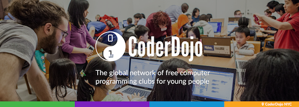

ComSSA (with a lot of help from Curtin Engineering Outreach) is going to be running a CoderDojo on campus! CoderDojo is a fantastic program which promotes programming and other computing disciplines to school students of all ages. ComSSA is going start running 6 week coding workshops (six classes per course, run weekly on Saturday), starting mid-May.

{: .center}

To make this happen, we need mentors. Mentors are the people that actually teach the Ninjas (students) how to code! You'll receive free technical and facilitation training from CoderDojo and Scitech, which means you'll know how to use the tools that we'll be using for the classes, as well as vital information on how to teach and manage children. As this is an official CoderDojo this is a 100% volunteer effort and paid positions won't be offered.
We're going to run this with two main tiers of mentors, plus a single senior position.

## Dojo Champion

A Dojo Champion leads the dojo. This is a senior role and you’ll be somewhat of a team leader for the lead and support mentors. Whilst a strong technical background is certainly a plus this is definitely a leadership role and we’ll be looking for leadership qualities above all else.

Some of the things you'll be responsible for:

- Confirm venue bookings with ComSSA
- Coordinate/help setting up the venue on the day
- Arrange IT access
- Attend each Dojo
- Help recruit mentors
- Organise a mentor roster
- Liaise with lead mentors RE their presentations
- Look after ninjas on the day, including greeting them, checking their names off, giving out name tags, organising ninja 'show me the code' presentations and recording ‘badges’ earned.

It’s required that you be available for all the sessions in the six-week course you apply for champion for. We will re-evaluate that champion after every course, and we’ll most likely change it to give all qualified applicants a shot.

## Lead Mentors

Lead mentors will be 'teaching' the class and be set up at the front of the lab. There'll be one to two lead mentors per day and they must have a little bit of technical knowledge. Keep in mind that you're teaching school kids about stuff you're going to be trained on, so you don't /have/ to be a superstar or anything.

## Support Mentors

Support mentors will roam around the class and talk to students and create an enthusiastic and energetic atmosphere. We're basically looking for people that'll roam around the rooms and ask the kids how they're doing, trying to provide basic support but more importantly showing enthusiasm towards the kids and what they're working on. This is a much less technical role, and although you will undergo training, other prior technical knowledge is not at all a requirement.

## I'm interested!

Applications will open at the start of semester so stay tuned.
