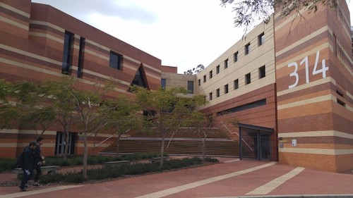

ComSSA is the club that supports computing, computer engineering, and networking
students at Curtin University. Most of the time, committee members can be found within the 314
level 2 labs.

We provide a wide range of [events] and [services] for our members, such as
academic assistance, social events, industry presentations, and free Microsoft
software licences!

[events]: /events/
[services]: /services/

{: .center}

Membership is open to everyone, even if you're not a student! Being affiliated
with the Curtin Student Guild also means that membership is free, if you have a
voucher from the Guild diary.

[Join us now][join] or contact us for any other enquiries:

  * [club@comssa.org.au][email]
  * [https://www.facebook.com/ComSSACurtin/][facebook]
  * [irc://irc.comssa.org.au/comssa][irc]
  *      ComSSA
      c/o Department of Computing
      Building 314
      Curtin University
      Kent Street
      Bentley WA 6102

[join]: /join/
[email]: mailto:club@comssa.org.au
[facebook]: https://www.facebook.com/ComSSACurtin/
[irc]: irc://irc.comssa.org.au/comssa
