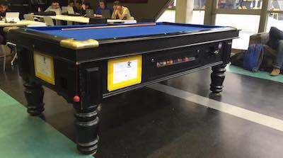

## Pool table

Our pool table is also available on the ground floor of the Engineering
Pavilion, open to be played on by anyone with a $1 coin.

{: .center}

## Microsoft DreamSpark

Microsoft provides computing students with a wide range of software licences for no
charge, including Windows and Visual Studio. ComSSA manages a [DreamSpark
Premium subscription][msdnaa] on behalf of the Department of Computing, so we're
the people to talk to if you want to get your hands on a bunch of *free*
Microsoft software.

[msdnaa]: /services/dreamspark/

## Unix shell accounts

Members are eligible to receive a free shell account on our Linux servers to
run mission-critical applications like <code>cmatrix</code> and
<code>cowsay</code>, send and receive email, and host simple websites. If you
wish to have an account setup, send us an [email][listemail] expressing interest
and we'll get you all set up.

[listemail]: mailto:club@comssa.org.au

## IRC

ComSSA provides an IRC channel for members to talk to each other in real time!
If you have an IRC client, [join our network][irc]! If you don't, we have a
[web chat service][webirc], as well as [more details][confirc] on how to connect
using your own client if you so desire.

[irc]: irc://irc.comssa.org.au/comssa
[webirc]: https://irc.comssa.org.au/
[confirc]: /services/irc/
