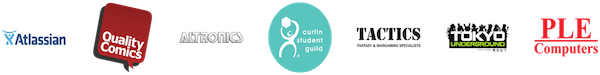

We’re pleased to have these _amazing_ sponsors who are generous enough
to provide us with prizes and offer discounts to our members:

{: .center}

  * [Atlassian] - Software Development Company based in Sydney
  * [Altronics] — Build It Yourself Electronics Centre
  * [Tactics] — Fantasy & Wargaming Specialists
  * [Quality Comics] — Comic Books, Posters, and Apparel

Show your membership sticker to the staff at any of these stores, and
you’ll receive a sweet discount.

{: .center}

Last but not least, please welcome [Atlassian] as one of our newest
sponsors in 2016! Named the [best place to work][best] by Business
Review Weekly in 2015, Atlassian has hired nine of our graduates this
year _alone_, and we’re looking forward to what will be an exciting
opportunity.

[Altronics]: http://www.altronics.com.au/
[Tactics]: http://www.tactics.net.au/
[Quality Comics]: https://www.facebook.com/qualitycomics
[Princess Margaret Hospital Foundation]: https://pmhfoundation.com/
[University Computer Club]: https://www.ucc.asn.au/
[ECE]: http://ece.curtin.edu.au/
[Atlassian]: https://www.atlassian.com/
[best]: http://www.brw.com.au/lists/best-places-to-work/2015/
